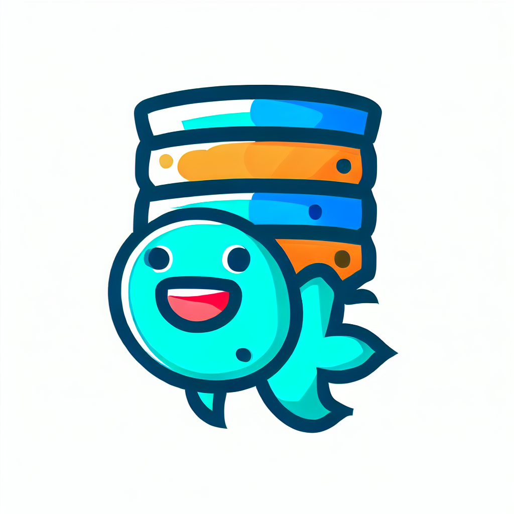

# IMT-Altruite-SemanticWeb

API for Altruite's Website

Authors :
- [Loic](https://github.com/lpi-code)
- [Maxime](https://github.com/nobozor)
- [Arthur](https://github.com/arthurmtx)

## URL

Site web : https://altruite.mtx.dev

Ontologie : https://mtx.dev/ontology/fishes

## Prérequis

- Flask
- rdflib

## Routes

### /api/poissons

- **GET** : Récupère tous les poissons

### /api/appats

- **GET** : Récupère tous les appats

### /api/habitats

- **GET** : Récupère tous les habitats

### /api/predateurs

- **GET** : Récupère tous les prédateurs

### /api/reproductions

- **GET** : Récupère tous les modes de reproduction

### /api/regimes

- **GET** : Récupère tous les régimes alimentaires

### /api/elements_anatomiques

- **GET** : Récupère tous les éléments anatomiques

### /api/poissons_vivipares

- **GET** : Récupère tous les poissons vivipares

### /api/poissons_ovipares

- **GET** : Récupère tous les poissons ovipares

### /api/poissons_mer_ocean

- **GET** : Récupère tous les poissons de mer et d'océan

### /api/poissons_taille_petite

- **GET** : Récupère tous les poissons de petite taille

### /api/poissons_vie_longue

- **GET** : Récupère tous les poissons de longue vie

### /api/poissons_branchies_2_8

- **GET** : Récupère tous les poissons avec 2 à 8 branchies